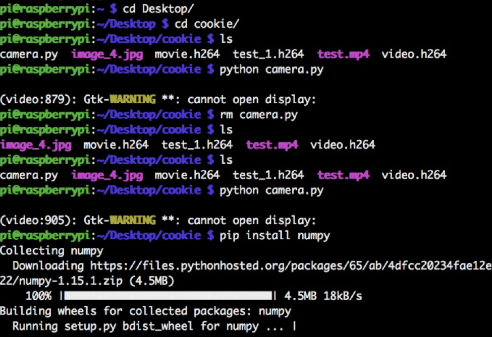
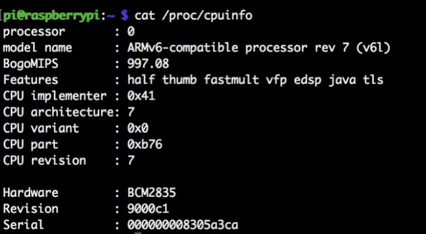
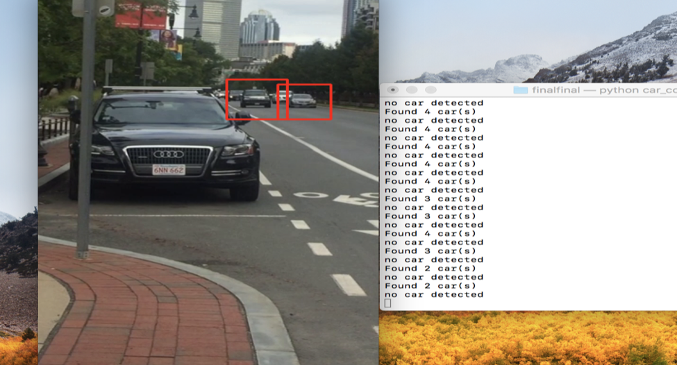

Car Counting using Raspberry Pi Zero W 

By:
Shreenidhi Jayaram
Qinglang Yu

EC463: Senior Design Mini-Hardware Project 
					September 20th, 2018 

Abstract 

An increase in population in city limits often correlates to higher vehicle congestion. Such congestion ultimately leads to the need to monitor traffic in order to be able to better control it. In pursuit of that, we’d need to employ a raspberry pi system coupled with a camera to count the number of vehicles passing through the frame at any given instant in time. Estimating the vehicle traffic per unit time is essential to monitoring air traffic pollution. 

Executive Summary 

The things we used were a raspberry pi zero W model with a pi NOIR camera. The Rasberry Pi acts as a microprocessor i.e. a computer by itself that interfaces with the camera in order to be able to capture car videos in motion. For all this to work, we first had to get the Operating System setup and working. 

Operating System 

1.	MicroSD Card : SanDisk Ultra 16 GB MicroSD card was used. 
2.	Operating System: The raspbian operating system from the official raspberry pi website was installed into the system. The software “Etcher” was used in order to be able mount the the raspbian lite image onto the SD Card. 
3.  SSH Client - To set up SSH, we used the command “sudo-raspi config” and were able to SSH into raspi.local. A screenshot of us being able to SSH into the raspi local is attached.

below: 

Image 1: “pi@raspberrypi” denotes that we were able to SSH into the pi’s network and “pip install numpy” is one of the libraries we installed onto the pi OS along with openCV that allowed us to execute our code 

4.  Pi’s Serial Number - Pi’s Unique Serial number is Serial: 000000008305a3ca

 

Methodology Overview
It was possible to count cars with the use of an OpenCV library for python. For this to be possible, the following steps were followed: 

1.First, install the latest version of python and pip into the SSH’d version of raspberry pi local. 
2. Use pip install to install libraries such as numpy and openCV. OpenCV which stands for open source computer vision is a library of programming functions which is aimed at real-time computer vision and image/video processing. In our case, this library will help us recognize cars and count the number of them passing through. 

Image 2: Video taken on commonwealth avenue and the red boxes show that the cars are detected and the terminal output show the amount of cars detected at any given instant. However,note the false positive on the tree on the far left. 

3. Set up code using openCV to draw a “rectangle” when a car/vehicle is detected and create a counter based system that allows you to create a counter every time car(s) pass the frame per unit time. 

Evaluation and Error Analysis

System Performance : The system that we have built right now successfully identifies cars in the passing by encapsulating in a red rectangular box. However, there is the problem of false positives as sometimes it finds other objects on the road/surroundings such as buildings, stationary cars that are mistaken for the dimensions of a vehicle. 

Potential Improvements:  The system could be improved by changing the mode of detection for accurate car counting. For example, instead of keeping count of all the cars at any instant of time, there could be a system which only counts the car  if it passes a certain “line” on the screen. Another potential improvement would be to identify different types of vehicles by specifying customized specifications for each type of vehicle. This could be useful because - having the same number of bicycles as cars do not necessarily contribute to the same amount of traffic or pollution and it would soon be essential to distinguish between the two. 

Algorithm Chosen: We chose to work with Python version 3.5 and with the openCV framework. This method was particularly employed because openCV provided an efficient way to read frames from a video and convert to gray scales for each of the frames while allowing us to institute a counter to count number of vehicles passing through. No user defined functions were instituted as the car counter per unit time was already specified in our original script. 

Sources: 

https://www.losant.com/blog/getting-started-with-the-raspberry-pi-zero-w-without-a-monitor

https://www.geeksforgeeks.org/

https://pypi.org/project/opencv-python/
